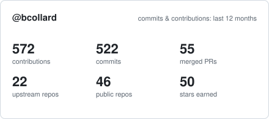
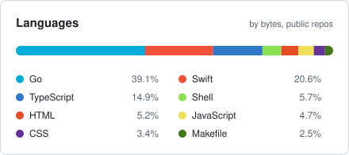

<h1 align="center">Baptiste Collard</h1>

  <em>{cloud, middleware, software} architect &nbsp;·&nbsp; dev.sec.ops.</em>

  
  
  
  

---

API gateways, service meshes and the plumbing underneath them — Envoy, Kubernetes,
Keycloak, PKI. I spend my days with enterprise platform teams and my evenings
building the tools I wish those platforms already had: small, single-binary,
`brew install`-able things that make a laptop feel like a real cluster.

Most of what is below started as "this takes me 20 minutes every time" and ended
up on the Homebrew tap.

---

## 🧊 What I'm building right now

<table>
<tr>
<td width="50%" valign="top">

### [klimax](https://github.com/bcollard/klimax) · [website](https://klimax.dev)

Multi-cluster [kind](https://kind.sigs.k8s.io/) manager for Apple Silicon. One Lima VM,
many clusters, and **pure L3 routing from macOS into the kind bridge** — no SNAT,
no VPN, real IPs for pods and `LoadBalancer` services. Coexists with OrbStack,
Colima or Rancher Desktop.

`Go` · dependency-free · [`klimax-ui`](https://github.com/bcollard/klimax-ui) SwiftUI companion app

</td>
<td width="50%" valign="top">

### [porthole](https://github.com/bcollard/porthole) · [website](https://porthole.runlocal.dev/)

Web-based debug terminal for Kubernetes, **designed for devs, not ops**. Pick a
pod, inject an ephemeral container (`netshoot`, `psql`, …), attach from the
browser. Pluggable OIDC authN and OPA authZ, audit logs, auto-sweep — so
developers reach pods without `kubectl` and without the cluster knowing their
corporate identity.

`Go` · Helm chart on `ghcr.io`

</td>
</tr>
<tr>
<td width="50%" valign="top">

### [headsmith](https://github.com/bcollard/headsmith) · [website](https://bcollard.github.io/headsmith/)

HTTP header editor for Chrome, built on `declarativeNetRequest` **and nothing
else** — there is no code path that *could* see your traffic, because none of the
extension's code runs when a request is made. `webRequest` is on a hard-fail list
in CI so it can't be added quietly.

`TypeScript` · WXT · reproducible builds + [build provenance](https://docs.github.com/actions/security-for-github-actions/using-artifact-attestations)

</td>
<td width="50%" valign="top">

### [Advanced Bookmarks](https://github.com/bcollard/chrome-advanced-bookmarks) · [website](https://bcollard.github.io/chrome-advanced-bookmarks/)

Replaces Chrome's bookmark dialog with a fuzzy-searchable folder picker. Type
three letters, land in any nested folder. Every release is byte-reproducible and
attested — `gh attestation verify` the zip you installed.

`JavaScript` · reproducible builds · [Chrome Web Store](https://chromewebstore.google.com/detail/advanced-bookmarks/lllhlboikkambnobbpjifhkpckiigdio)

</td>
</tr>
<tr>
<td width="50%" valign="top">

### [Pastiche](https://github.com/bcollard/pastiche) · [website](https://pastiche.runlocal.dev/)

Keyboard-first clipboard manager for macOS, living in the menu bar. Text and
image history with inline previews, type filters and instant search — and
**nothing leaves the Mac**.

`Swift` · SwiftUI · `brew install --cask bcollard/pastiche/pastiche`

</td>
<td width="50%" valign="top">

### keycloak-cloudrun

Keycloak on Google Cloud Run, entirely in Terraform — Cloud SQL Postgres behind a
Serverless VPC connector, a global load balancer, managed TLS and private DNS. Built
so a lab IdP **survives cluster resets**: wipe every kind cluster you own and the
realms, clients and users are still there.

`Terraform` · Cloud Run · Cloud SQL · Secret Manager

</td>
</tr>
</table>

---

## 🧰 The toolbelt — `brew install`-able single binaries

<!-- profile:begin:toolbelt -->
| | | |
|---|---|---|
| **[keycloak-cli](https://github.com/bcollard/keycloak-cli)** | Manage Keycloak realms, clients, users, groups and OAuth scopes from the terminal. No Docker, no Java, no `kcadm.sh` in a pod. | `Go` |
| **[homepki](https://github.com/bcollard/homepki)** · [website](https://bcollard.github.io/homepki/) | Your own three-tier PKI for home labs — root CA, intermediates, server & client certs. mTLS labs in four commands. | `Go` |
| **[push-to-cdn](https://github.com/bcollard/push-to-cdn)** | Drop a file in a GCS bucket, get a public URL back. For workshops, demos and long-lived assets. | `Go` |
| **[svg2drawio](https://github.com/bcollard/svg2drawio)** · [website](https://svg2drawio.runlocal.dev) | Turn an SVG into a real draw.io diagram — every element becomes a native mxGraph cell you can move, restyle and edit, not an embedded image. | `Go` |
| **[kuma-migrator](https://github.com/Kong/kuma-migrator)** · [website](https://kong.github.io/kuma-migrator/) | Migrates Kuma / Kong Mesh users from `kuma.io/service` to the MeshService API, with deprecation scans for Kuma 2.11–2.14. | `Go` |
| **[Claude Status](https://github.com/bcollard/claude-status-macos-menu-bar)** · [website](https://claudestatus.runlocal.dev/) | macOS menu-bar app for Claude Code usage: live plan limits, today's spend, weekly cap, per-model breakdown. ~1.5k lines of Swift, no Electron. | `Swift` |
| **[slack-clauded-status-updater](https://github.com/bcollard/slack-clauded-status-updater)** | Rotates your Slack status with Claude Code "thinking mode" words on a schedule. Cloud Function + Scheduler + Terraform, because why not. | `Go · HCL` |
<!-- profile:end:toolbelt -->

<!-- profile:begin:taps -->
Taps: [`bcollard/claude-status`](https://github.com/bcollard/homebrew-claude-status) · [`bcollard/homepki`](https://github.com/bcollard/homebrew-homepki) · [`bcollard/keycloak-cli`](https://github.com/bcollard/homebrew-keycloak-cli) · [`bcollard/klimax`](https://github.com/bcollard/homebrew-klimax) · [`bcollard/kuma-migrator`](https://github.com/bcollard/homebrew-kuma-migrator) · [`bcollard/pastiche`](https://github.com/bcollard/homebrew-pastiche) · [`bcollard/push-to-cdn`](https://github.com/bcollard/homebrew-push-to-cdn) · [`bcollard/svg2drawio`](https://github.com/bcollard/homebrew-svg2drawio)
<!-- profile:end:taps -->

---

## 🌱 Upstream

Where I send patches when the tool I depend on is missing a piece:

<!-- profile:begin:upstream -->
- **[containerd/containerd](https://github.com/containerd/containerd)** — `cri`: honour the platform configured in `runtime_platforms`
- **[lima-vm/lima](https://github.com/lima-vm/lima)** — stop identifying additional disks by filesystem label
- **[gnachman/iTerm2](https://github.com/gnachman/iTerm2)** — two-row tab bar
- **[Kong/charts](https://github.com/Kong/charts)** — `Service.spec.trafficDistribution` support for zone-aware routing
- **[kgateway-dev/kgateway](https://github.com/kgateway-dev/kgateway)** (ex-Gloo Edge) — ~28 merged PRs: production-readiness guides, zero-downtime gateway rollouts, NLB/TLS termination, timeouts, dynamic forward proxy
- **[Kong/ai-deck-converter](https://github.com/Kong/ai-deck-converter)** · **[mccutchen/go-httpbin](https://github.com/mccutchen/go-httpbin)** · **[kumahq/kuma-demo](https://github.com/kumahq/kuma-demo)** · **[kumahq/kuma-website](https://github.com/kumahq/kuma-website)** · **[gohugoio/hugo](https://github.com/gohugoio/hugo)** · **[giraffi/fluent-plugin-amqp](https://github.com/giraffi/fluent-plugin-amqp)**
<!-- profile:end:upstream -->

---

## ✍️ Writing & speaking

📝 **[baptistout.net](https://baptistout.net/posts/)** — long-form, mostly on things that are annoying to figure out from the docs:

<!-- profile:begin:writing -->
- [Run multiple Kubernetes clusters on macOS with LoadBalancer support](https://baptistout.net/posts/kubernetes-clusters-on-macos-with-loadbalancer-without-docker-desktop/) — the post that became [`kind-on-lima`](https://github.com/bcollard/kind-on-lima-public) ⭐30, and eventually `klimax`
- [How Kubelet actually runs containers](https://baptistout.net/posts/how-kubelet-actually-runs-containers/)
- [Let's make OpenID Connect crystal-clear](https://baptistout.net/posts/oidc/)
- [Passwordless authentication with WebAuthn, Keycloak and Istio](https://baptistout.net/posts/passwordless-authentication-webauthn-keycloak-istio/)
- [Upgrade to HTTP/3 with Envoy](https://baptistout.net/posts/upgrade-envoy-http3/)
- [How I conduct technical interviews, with the question matrix](https://baptistout.net/posts/how-i-conduct-technical-interviews-questions-matrix/)
<!-- profile:end:writing -->

🎤 **Talks & webinars**

<!-- profile:begin:talks -->
- [Multi-cluster Mesh by Kong — APIDays Paris](https://baptistout.net/other/apidays-paris-2023/) · *Dec 2023*
- [Get to know Envoy — ContainerDays Hamburg](https://baptistout.net/other/container-days-hamburg/) · *Sep 2023*
- [10 things I wish I had known before using Istio — Solo.io](https://baptistout.net/other/webinar-10-things-istio/) · *Mar 2023*
- [Istio Gateway on steroids with WebAuthn — APIDays Paris](https://baptistout.net/other/apidays-paris-2022/) · *Dec 2022*
- [Envoy — le proxy moderne pour les infra cloud-native — OSXP Paris](https://baptistout.net/other/opensource-xp-paris/) · *Nov 2022*
- [Istio Gateway on steroids with WebAuthn — APIDays London](https://baptistout.net/other/apidays-london-2022/) · *Oct 2022*
- [Getting started with Envoy — KubeHuddle Edinburgh](https://baptistout.net/other/kubehuddle-edinburgh/) · *Oct 2022*
<!-- profile:end:talks -->

---

## 🧑‍🔧 Toolbox

  
  
  
  
  
  
  
  
  
  
  
  

---

  <picture>
    <source media="(prefers-color-scheme: dark)" srcset="assets/stats-dark.svg">
    
  </picture>
  <picture>
    <source media="(prefers-color-scheme: dark)" srcset="assets/languages-dark.svg">
    
  </picture>

<em>Read. Understand. Do. Repeat.</em>

